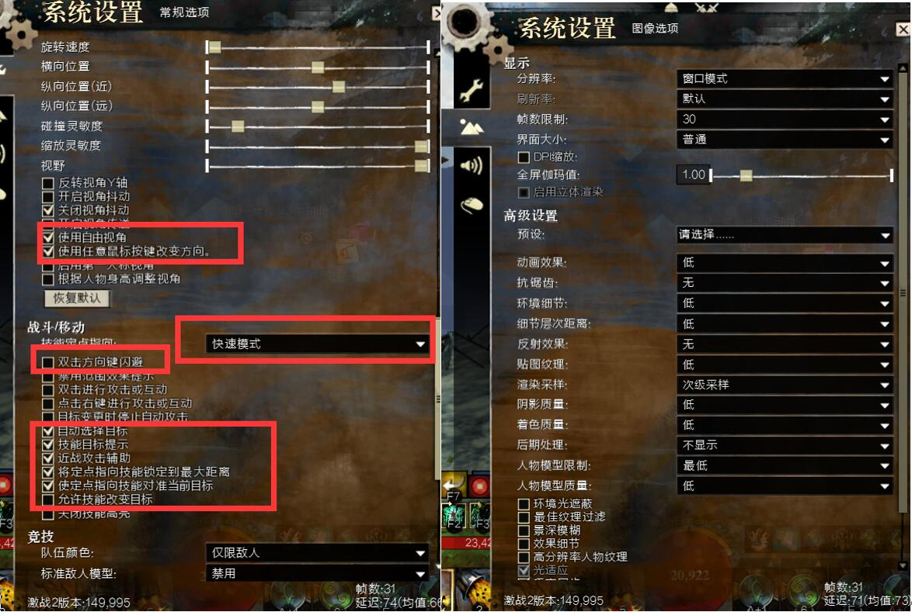
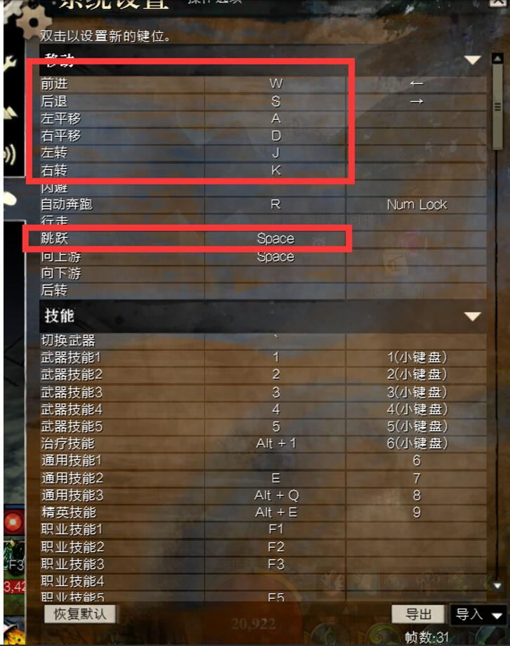
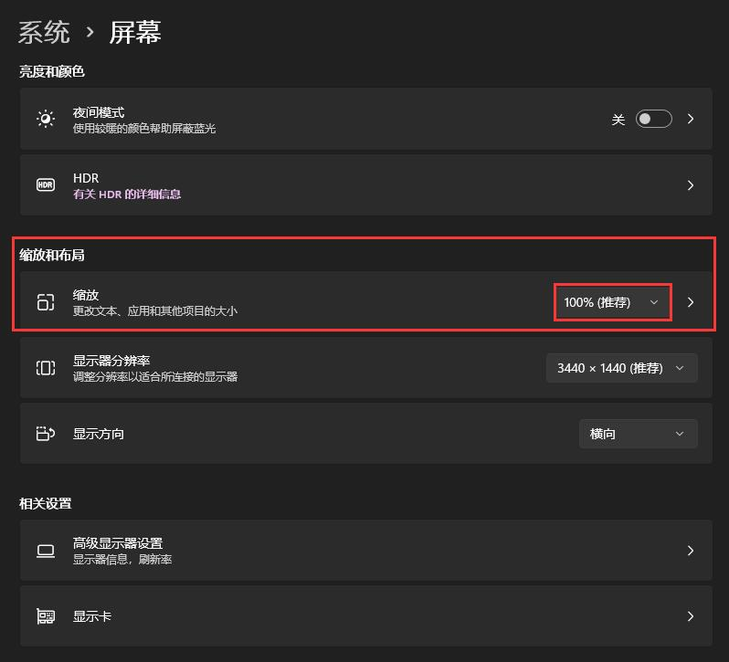

# 使用教程

## 1.下载
- 下载`Release`发布的编译版本
- 或者：下载源代码

## 2.环境设置
- **必须**将目录下的`Driver`文件夹添加到系统环境变量！*此文件夹作用：调用dx11后台截图并进行图像检测。* 本项目使用的是[Aibot](http://www.aibote.net/)自动化框架。如果你对此框架不信任，推荐你自行修改源码，可替换为开源的[op](https://github.com/WallBreaker2/op)框架。
- **如何设置系统环境变量？** 自行百度
- 如果你下载的是源代码，则需要安装相关环境。需求列表懒得一一列出了。最重要的是安装`AiBot.py`。执行`pip install AiBot.py==1.2.5`即可。

## 3.游戏设置
- 系统设置中启用：`使用自由视角`
- 系统设置中**必须关闭**：`双击方向键闪避`
- 快捷键**必须设置**：`W前进`、`S后退`、`A左平移`、`D右平移`、`J左转`、`K右转`
- **强调**：`J左转`、`K右转`**必须设置**！否则寻路时不能自动转动视角

## 4.启动脚本
- 设置好环境后运行`Gw2AutoPvp.exe`
- 或者：安装相关环境后运行`Gw2AutoPvp.py`
- **注意**：必须进入pvp地图-迷雾之心后，开启本脚本

## 5.其他注意事项
- 右键系统桌面-显示设置，其中的`缩放`必须设置为100%！否则无法识别游戏图像
- 支持自动释放技能，需要更改`config`文件夹下的`suicide.txt`文件！
- **注意**：必须进入pvp地图-迷雾之心后，开启本脚本

## 6.开发者-如何编译exe
- 强烈推荐使用`nuitka`来编译！
- 安装`nuitka`等编译环境。此处不详细列举，可自行去B站、知乎搜索相关教程！
- 进入项目根目录
- 执行`nuitka --mingw64 --standalone --show-progress --include-module=wmi --output-dir=out --windows-icon-from-ico=logo.png Gw2AutoPvp.py`
- 注意编译完成后，必须将原`config`、`src`文件夹复制到编译输出的文件夹中，否则会导致运行时无法找到相关文件！

## 7.开发者-如何寻找基址

## 附件
- 游戏设置截图

- 系统设置截图

